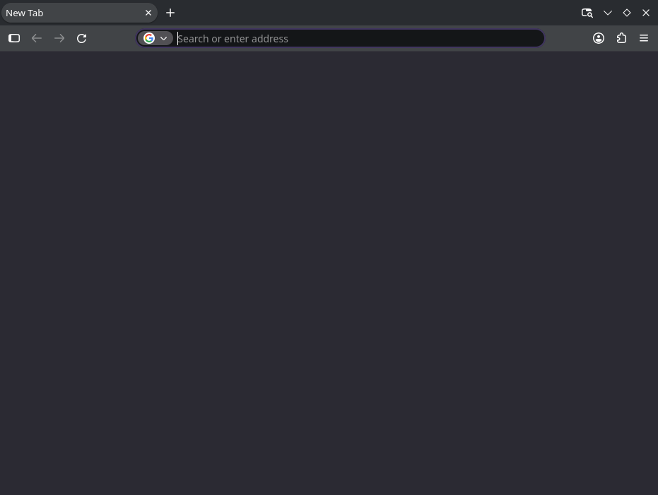

# Firefox

Firefox 157.0.1, built against the shim with the X11-only GTK3 toolkit
(`--enable-default-toolkit=cairo-gtk3-x11-only`), runs as a native Wayland
application: no X server, no Xwayland, and no X11 protocol on the wire.

Firefox -> GTK3 (X11 backend) -> cairo -> Xlib -> Wayland

This is the same path as the other GTK3 targets (GIMP 2.10 / MATE); Firefox is
the largest Xlib client exercised so far and the first that drives the parts of
the shim a browser needs at once — client-side decorations, `xdg_popup` menus,
XRender text, XSETTINGS, clipboard/XDND, XInput2, compositing and the XCB/SHM
capability probes.

## Build

1. Build and install the shim (see the README):

   ```sh
   meson setup build && meson install -C build   # into ~/.local/xlib-wayland
   ```

2. Point Firefox at the installed prefix with the reference mozconfig and
   build:

   ```sh
   cp scripts/firefox-mozconfig /path/to/firefox-157.0.1/mozconfig
   cd /path/to/firefox-157.0.1
   ./mach configure && ./mach build
   ```

   The resulting binary is `obj-x11/dist/bin/firefox`.

## Run

There is nothing Firefox-specific to set at run time — it is told to use the
X11 toolkit and the shim does the rest. The headless runner starts the bundled
compositor, launches Firefox with the shim first on the library path, and
captures a PNG of the presented frame:

```sh
scripts/run-firefox-headless.sh 1024x768 40
```



The capture shows the real browser chrome — tab strip, navigation toolbar, URL
bar and window controls — rendered without any X server.

To run it on a live session instead, do the same environment with the session's
own compositor: `GDK_BACKEND=x11 MOZ_ENABLE_WAYLAND=0` and
`LD_LIBRARY_PATH=$HOME/.local/xlib-wayland/lib` on the Firefox binary.

## What Firefox exercises

| Area | Shim path |
|---|---|
| GDK X11 backend bring-up | display/screen/visual, RENDER, XFIXES, Xcursor, XInput2, XSETTINGS |
| Browser chrome + content | XRender text/glyphs, `XPutImage`, compositing, RGBA windows |
| Client-side decorations | EWMH `_NET_SUPPORTED` / `_NET_SUPPORTING_WM_CHECK`, CSD, `xdg_toplevel` move/resize (`_NET_WM_MOVERESIZE`) |
| Menus (hamburger, context) | override-redirect popup promoted to `xdg_popup`, grab, focus kept on the toplevel |
| Clipboard / drag-and-drop | X selections ⇄ Wayland data device; XDND |
| MIT-SHM capability probe | `libX11-xcb` returns an error-state XCB connection, so `nsShmImage` falls back to `XPutImage` |

## Known state

- **Software compositing.** WebRender runs in software
  (`gfx.webrender.software`); there is no GPU/EGL path. The runner sets this,
  but it is the working configuration on any machine.
- **No MIT-SHM.** XCB-based SHM is deliberately not implemented; Firefox falls
  back to the core `XPutImage` upload path (see `src/xlib/x11xcb.c`).
- Menus, window dragging and focus switching have been exercised interactively
  on a KWin/Wayland session; rendering is also capture-verified headless. A
  software-composited window could be blanked when GDK reset a window's
  background during a popup dismissal — fixed in
  `window: don't repaint the surface when the background attribute changes`.
